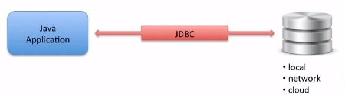
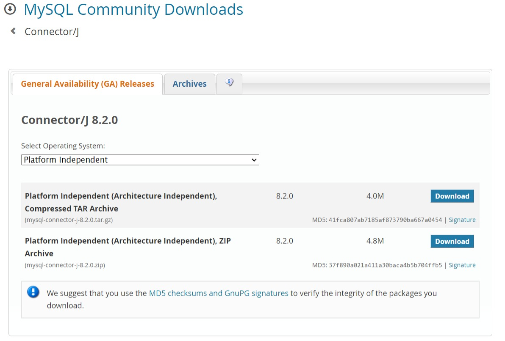

# **Java Database Connection JBDC and MySQL**

---

+ Connect to a `MySQL` Database with `Java`
+ Submit `SQL` statements to insert, update and delete data.
+ Handle `SQL` parameters with `Prepared Statements`
+ Calls stored procedures and handle Various parameter types `(IN, INOUT etc ...)`
+ Read and write `BLOB` and `CLOB` data files.
+ Configure your database connection information with properties files.

# **Java JDBC Overview**

----

+ What is `JBDC`?
+ Features
+ Database Support
+ Architecture
+ Development Process

# **What is JDBC?**

---

+ **`JDBC`**

    + Allows `Java` applications to connect to a relational database.
  
    

# **Features**

---

+ Provides portable access to various databases.
  + No need to develop code for different databases
  
+ Call level interface to the database
  + Supports `ANSI SQL 2023`
  
+ You can build your own custom `SQL` statements
  + `select, insert, update, delete`
  + Complex `SQL` queries: `inner/outer joins`
  + Call stored procedures

# **Databases Supported**

---

+ `JDBC` supports a large number of databases
  + List : http://www.oracle.com/technetwork/java/index-136695.html
+ `Oracle, DB2, MySQL, SQL Server, Postgres etc ...`

# **JDBC Architecture**

----

+ `JDBC Driver`
  + Provides connection to a database.
  + Converts `JBDC` calls to for specific database
+ `JDBC Driver` implementations
  + Provided by database vendor

# **JDBC Driver Manager**

---

+ `DriverManager` helps to connect an application based on the database connection string.
+ In `JDBC 4.0`, the `JDBC` drivers are automatically loaded based on the `classpath`.
+ Legacy `JDBC 3.0` drivers have to be explicitly loaded with : **`Class.forName(theDriverName`**.

# **JDBC API**

----

+ `JDBC API` is defined in the following packages
  + **`java.sql`** and **`javax.sql`**
+ Key classes
  + **java.sql.DriverManager**
  + **java.sql.Connection**
  + **java.sql.Statement**
  + **java.sql.ResultSet**
  + **javax.sql.DataSource** (for connection pooling)

# **Development Process**

<ol>
  <li>Get a connection to database</li>
  <li>Create a Statement object</li>
  <li>Execute SQL Query</li>
  <li>Process Result Set</li>
</ol>

# **Step 1: Get a connection to database**

+ In order to connect to database.
  + Need a connection string in form of `JDBC URL`

+ Basic syntax

      jdbc:<driver protocol>:<driver details>

+ Examples

<table>
  <thead>
    <tr>
      <th>Databases</th>
      <th>JDBC URL</th>
    </tr>
  </thead>
  <tbody>
    <tr>
      <td>MS SQL Server</td>
      <td>jdbc:odbc:DemoDSN</td>
    </tr>
    <tr>
      <td>Oracle</td>
      <td>jdbc:oracle:thin@myserver:1521:demodb</td>
    </tr>
    <tr>
      <td>MySQL</td>
      <td>jdbc:mysql://localhost:3306/demodb</td>
    </tr>
  </tbody>
</table>

+ Code snippet for connecting to `MySQL`

      import java.sql.*;
      
      ....
      String dbURL = "jdbc:mysql://localhost:3306/demo";
      String user = "student";
      String pass = "staudent";

      Connection myConn = DriverManager.getConnection(dbUrl, user, pass);

      failure to connect will throw an exception:
        - java.sql.SQMException: bad url or credentials
        - java.lang.ClassNotFoundException: JDBC driver not in classpath

# **Step 2 : Create a Statement Object**

---

+ The `Statement` object is based on connection.
  + It will be used later to execute `SQL`query.

        import java.sql.*;

        ....
        String dbURL = "jdbc:mysql://localhost:3306/demo";
        String user = "student";
        String pass = "student";

        Connection myConn = DriverManager.getConnection(dbUrl, user, pass);

        Statement myStmt = myConn.createStatement();

# **Step 3 : Execute SQL Query**

+ Pass in your `SQL` query.

        import java.sql.*;

        ....
        String dbURL = "jdbc:mysql://localhost:3306/demo";
        String user = "student";
        String pass = "student";

        Connection myConn = DriverManager.getConnection(dbUrl, user, pass);

        Statement myStmt = myConn.createStatement();

        ResultSet = rs = myStmt.executeQuery("select * from employees");

# **Step 4 : Process the Result Set**
+ `Result Set` is initially placed before first row.
+ Method : `ResultSet.next()`
  + moves forward one row
  + returns true if there are more rows to process
+ Looping through a result set.

  + `getXXX(columnName)`
  + `getXXX(columnIndex` one-based

        '''
        ResultSet myRs = myStmt.executeQuery("select last_name, first_name from employeed")

        while(myRs.next()) {
          System.out.println(myRs.getString("last_name"));
          System.out.println(myRs.getString("first_name"));
        }

# **Database Setup**

+ Before you can run the java code in this course, you must follow the two steps.

<ul>
  <li>Step 1 : Install MySQL</li>
  <li>Step 2 : Create New User: student</li>
</ul>

# **Install the MySQL Database**

+ [Downloads Mysql](http://dev.mysql.com.downloads)

# **Install JDBC Driver**

+ [JDBC MySQL Driver](https://dev.mysql.com/downloads/connector/j/)

# **Prepared Statements**

---

+ A `Prepared Statement` is a precompiled `SQL` statement.
+ `Prepared Statement` provide the following benefits
  + Makes it easier to set `SQL` parameter values
  + Prevent against `SQL` dependency injection attacks.
  + May improve application performance.
    + `SQL` statement is precompiled

# **Topics**

---

+ What are Stored Procedures
+ Using callable Statements
+ Call Stored Procedures that take parameters

  + `IN` parameters
  + `INOUT` parameters
  + `OUT` parameters
  + `Return` a result set

# **Stored Procedures**

---

+ A group of `SQL` statements that perform a particular task.
+ Normally created by the `DBA`
+ Created in a `SQL` language supported by the native database.
+ Can have any combination of `input, output, and input/output` parameters.

# **Parameters**

---

+ The `JDBC API` supports different parameters
  + `IN` (default)
  + `INOUT`
  + `OUT`

+ The stored procedure can also return result sets.
+ Following code examples will show to register parameter types and values.

# **`IN` Parameters**

---
+ Our `DBA` created a stored procedure
  + Developed for `MySQL`
  
        PROCEDURE `increase_salaries_department` (
            IN the_department VARCHAR(64), IN increase_amount DECIMAL(10, 2))
  
        BEGIN
            UPDATE employeees SET salary = salary + increase_amount
            WHERE department = the_department
        END
  
+ Increase salary for everyone in a department
  + First param is the department name
  + Second param is the increase amount

# **What Are Transactions**
+ A `transaction` is a unit of work.
+ One or more `SQL` statements executed together
  + Either all of the statements are executed - `Commit`
  + Or none of the statements are executed - `Rollback`
  + By default, the database connection is to `auto-commit`
  + Need to explicitly run turn off `auto-commit`
  
        myConn.setAutoCommit(false);

+ Developer controls `commit or rollback`

        myConn.commit();
        
        // or

        myConn.rollback();

# **Get Metadata Instance**

+ Retrieve the metadata instance

    DatabaseMetaData databaseMetaData = myConn.getMetaData();

+ `DatabaseMetaData` methods

  + `getDatabaseProductName()`
  + `getDatabaseProductVersion()`
  + `getDriverName()`
  + etc ...
  
+ See `JavaDoc` for details
  + Google: `jdbc databasemetadata`

# **Get ResultSet MetaData**

+ Retrieve the metadata instance

        ResultSetMetatada myRsMetaData ) myRs.getMetaData();

+ Sample of `ResultSetMetaData` methods

|                   |                 |                     |
|-------------------|-----------------|---------------------|
| getColumnName()   | getColumnType() | getColumnTypeName() |
| getPrecision()    | getScale()      | getColumnCount()    |
| isAutoIncrement() | isNullable()    | isCurrency()        |
| ....              | ....            | ....                |

+ See `JavaDoc` for Details
  + Google : `javadoc jdbc resultset metadata`.
  

  
# **What is BLOB?**

---

+ A `BLOB (Binary Large Object)` is a collection of binary data stored as a single entity in a database.
+ `BLOBs` are typically documents, images, audio or other binary objects.
+ Note: Database support for BLOBs is not universal

# **Writing BLOBs**
+ Add a resume for an employee
  + Read local PDF file: sample_resume.pdf
  + Update database with the binary data
  

      // Prepare Statement

      String sql = "update employee set resume=?" + 
                    " where email='john.doe@foo.com'";

      PreparedStatement myStmt = myConn.prepareStatement(sql);

      // Set parameter for resume file_name
      File theFile = new File("sample_resume.pdf");
      FileInputStream input = new FileInputStream(theFile);

      myStmt.setBinaryStream(1, input);

      // Execute statement
      myStmt.executeUpdate(sql);

# **What is a CLOB?**

+ A `CLOB (character large object)` is a collection of character data stored as a single entity in a database.
+ `CLOBs` are typically used to store large text documents (plain text or XML).
+ Note: database support for CLOBs is not universal.

      

  

